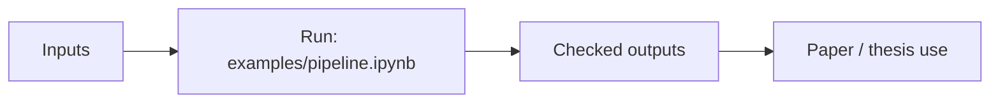

# blocksnet

Urban blocks, accessibility, provision, and service-placement library.

## Scheme



## Main Result


## Run

Entrypoint: `examples/pipeline.ipynb`

Human:

```bash
pip install -e . && jupyter notebook examples/pipeline.ipynb
```

Agent:

Prefer existing BlocksNet APIs over custom geometry/service helpers.

## Publication

Library documentation: https://aimclub.github.io/blocksnet/

## Next Steps / Heuristics

Keep wrappers thin; add new abstractions only when they remove duplicated pipeline code.
