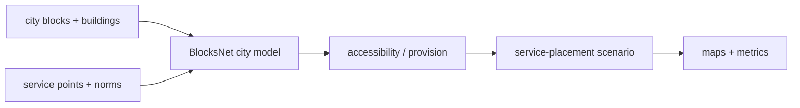

# blocksnet

[](https://github.com/aimclub/OSA)

Urban analytics library for blocks, accessibility, service provision, and placement scenarios. In the dissertation workspace it is the main reusable spatial-analysis engine.

## System Map



## Main Result


## Run

Entrypoint: `examples/pipeline.ipynb`

Human:

```bash
pip install -e . && jupyter notebook examples/pipeline.ipynb
```

Agent: reuse BlocksNet APIs before writing geometry/service helpers in the parent pipeline.

## Publication

Documentation: https://aimclub.github.io/blocksnet/

## Next Steps / Heuristics

Heuristic: keep wrappers thin. Add abstractions only when they remove duplicated pipeline code or expose a stable analytical operation.

